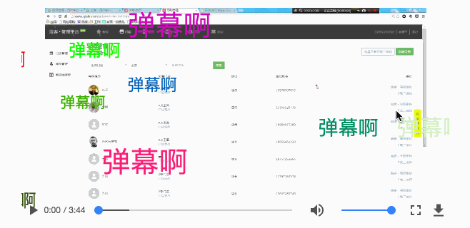

## danmu-plugin

A danmu plugin which can be used in video tag

应用于H5的video标签的弹幕插件

## 背景介绍 (introduce)

看吃鸡直播的时候，突发奇想想实现一套适用于H5video的弹幕插件，对应的博客地址为[blog-address](https://mickey0524.github.io/2017/09/16/danmu-plugin-design/)，里面有实现的一些思路

## 依赖（dependence）

没有任何依赖，插件使用纯ES5语法编写，兼容各种浏览器

## 使用方法（usage）

引用js，Danmu类会被挂在到window对象上，调用new Danmu(selector, options)创建一个实例即可

```
<script src="../dist/danmu.min.js"></script>
<script type="text/javascript">
var danmuPlugin = new Danmu('danmu-plugin', { faskDanmu: true, faskDanmuSpace: 50 });
var danmuList = [];
for (var i = 0; i < 20; i++) {
  danmuList.push({});
}
danmuPlugin.updateDanmuList(danmuList);
</script>
```

## 参数列表（options）

| 参数           | 说明     | 默认值  | 可填值 |
| ------------- |:--------:| :------:| :-----:|
| faskDanmu      | 是否开启弹幕追击模式，即速度快的弹幕如果不会覆盖到前面速度慢的弹幕，也会被添加进入轨道 | false | true |
| faskDanmuSpace | 追击模式下，弹幕的最小间距      | 0 | number(比如100) |

## API

暴露一些功能，可以让插件更加容易使用

updateDanmuList([{}]) 更新弹幕数组

一条弹幕的结构如下所示，下面4个参数都不输入也行，插件岁自动随机生成

```
{
	size: 18,
	color: '#FCF',
	content: '弹幕',
	speed: 60 //速度代表一秒移动多少px
}
```

openFaskDanmu(faskDanmu, faskDanmuSpace) 更新插件工作模式

| 参数            | 说明            | 可填值         |
| :------------: | :-------------: | :-----------: |
| faskDanmu      | 是否开始追击模式   | true/false    |
| faskDanmuSpace | 追击模式下弹幕间距 | number，默认为0 |

openDanmu() 打开弹幕插件开关

closeDanmu() 关闭弹幕插件开关

toggleDanmu() 转换弹幕插件开关

## 示例

可见 test.html，这里也给出一张示意图




